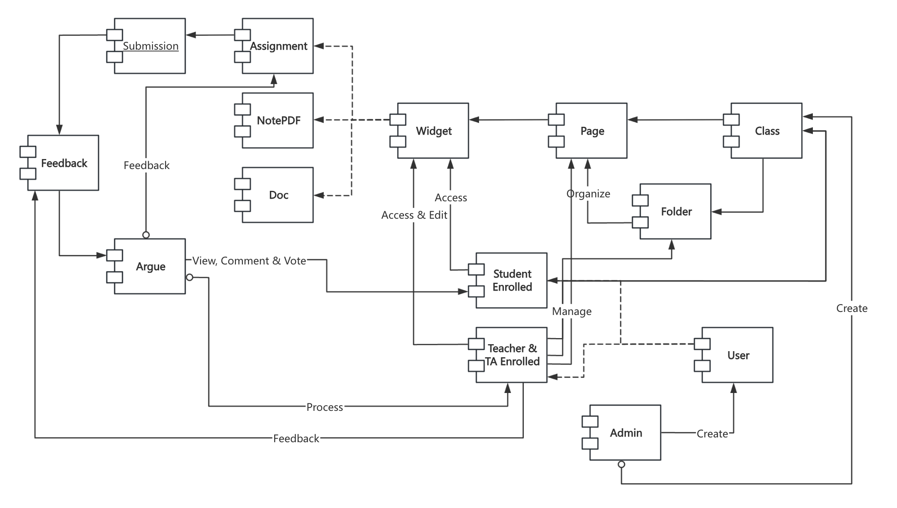
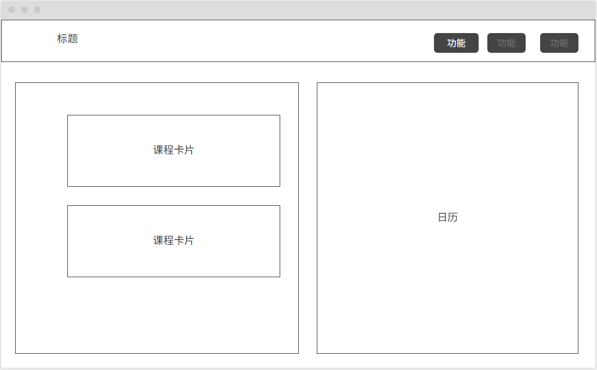
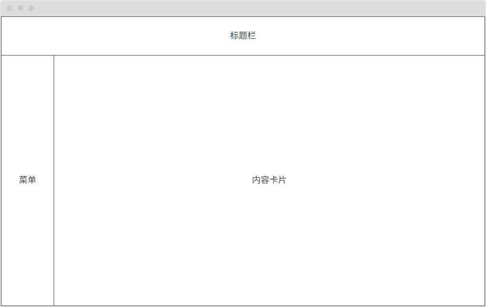
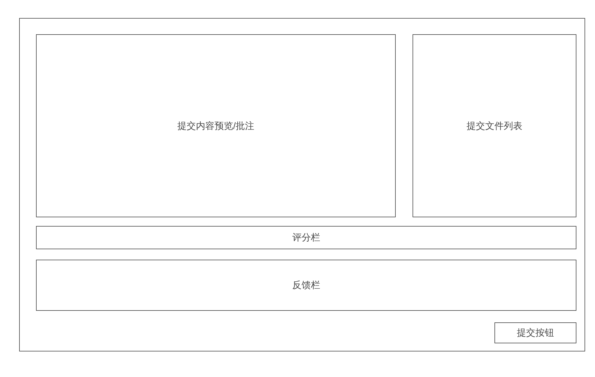
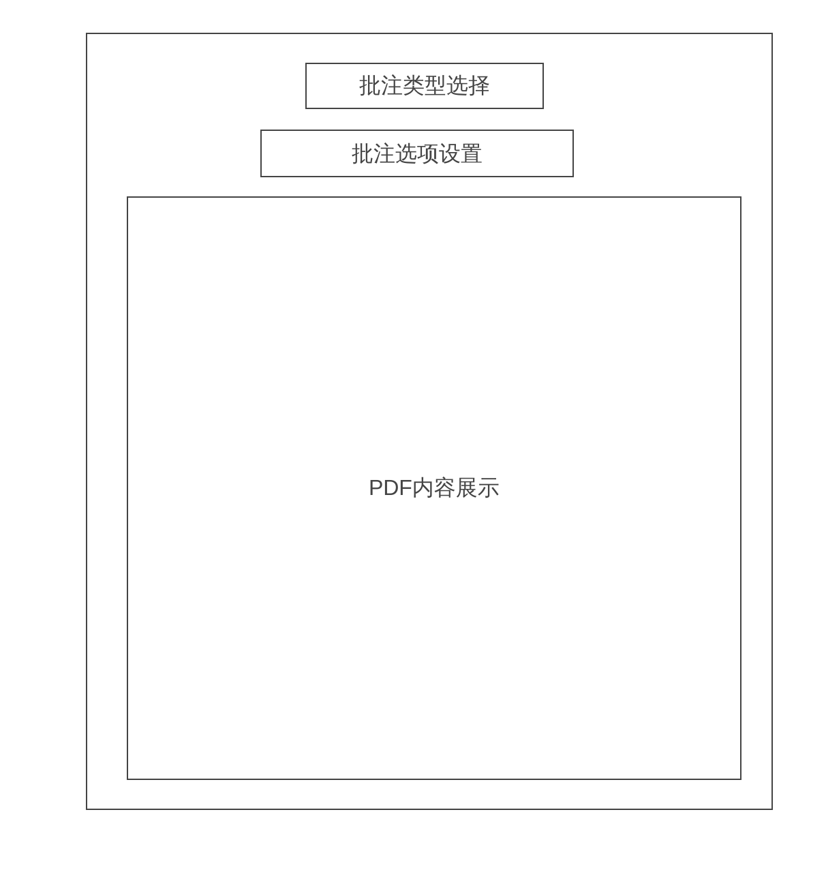
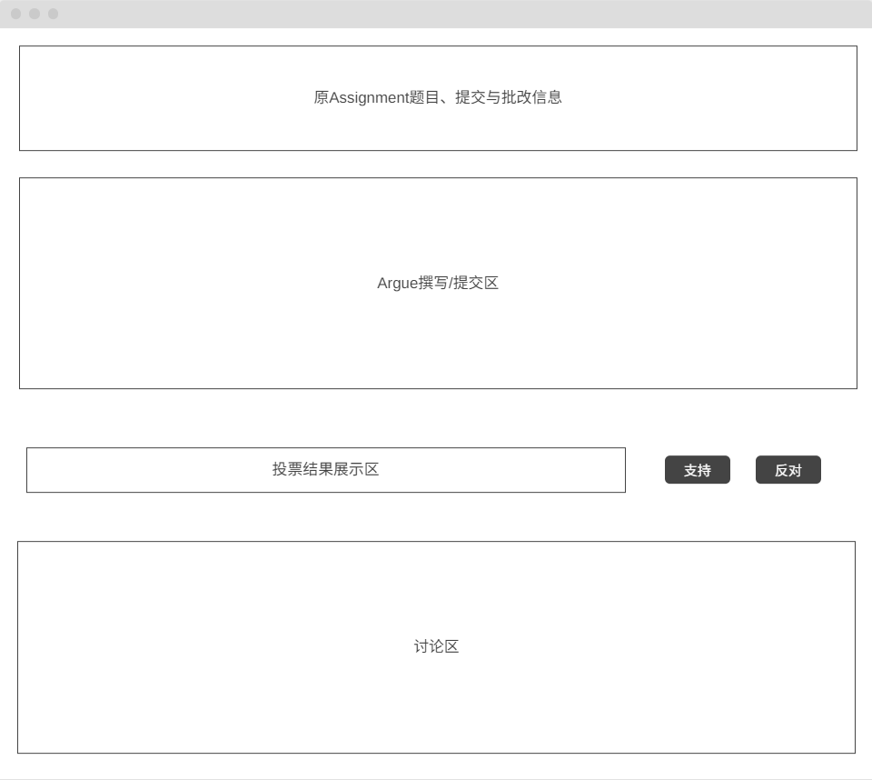

# Architechture Design

## Overview Component Diagram

The following figure shows the component diagram of the system.

## Components

The system consists of the following components:

- *Class*: Manages the class resources and users including the list of students, teachers and TAs. The type of class resources are:

  - *Logical resources*. Used to manage minial resources, widget.

    - *Page*: The page in the class. It contains the list of widgets. Page is the direct and unique ancestor of widget. All widgets are contained in a page.
    - *Folder*: The folder of pages. It contains the list of pages. Folder is used to group and index pages.
  - *Widget*. Widget is the all-in-one component of the class. It can be

    - *Document*: a universal content displaying widget. It can render markdown and include attachments.
    - *Assignment*: a widget for assignment. It can be used to create and manage assignments. It can easily show assignment requirements, submit assignments, can also be used to display the assignment results.
    - *NotePDF*: a widget for note taking. It can be used to take notes and display the notes among students. Notes will be saved in cloud and render in browser.
- *Feedback& Argue*: Teachers can give feedback to students accroading to the assignment they submitted, students can argue with the feedback.

  - *Feedback*: The feedback given by the teacher. It includes the marked assignment, feedback content and score.
  - *Argue*: The argue given by the student. It's like a post, including the argument content and the feedback it argues. The argue will be show in the argue plaza page, and all the students in the same class can see it. Students can comment on the arguement, vote for the argument, and the teacher make new feedback according to the argument.

## Design Idea

1. Why widget?

   - We hope there is a kind of *abstract resource* that can represent all the resources in the class. So we can easily display and manage the resources in the class.
   - Widgets can be *easily reused*.
   - For example, in the argue post, we need original assignment, feedback and argue content. We can use the widget component to represent the original assignment (including the feedback, submissions, etc.), then the frontend can easily render the widget and show the original assignment.

- Widgets can be *easily extended*.

  - For course resources, there are many common fields. Widget is basically implemented by an *inheritance* machanism. We can easily add new widget types by inheriting the base class.

2. Why feedback and argue are not widgets?

   - Basically, *widgets are used to represent the course resources*. But the feedback and argue are not course resources. They are used to *represent the interaction between students and teachers*.
3. Why feedback and argue are two components?

   - The feedback and argue are *loosely coupled*. The feedback is given by the teacher, and the argue is given by the student. They are not directly related. So we can use two components to represent them.
4. Why single feedback?

- Feedback can be extended to multiple types. *Human feedback* and *Machine/AI feedback*.

# UI Design

## Homepage

## Class

## Feedback

## PDF mark

## Argue

