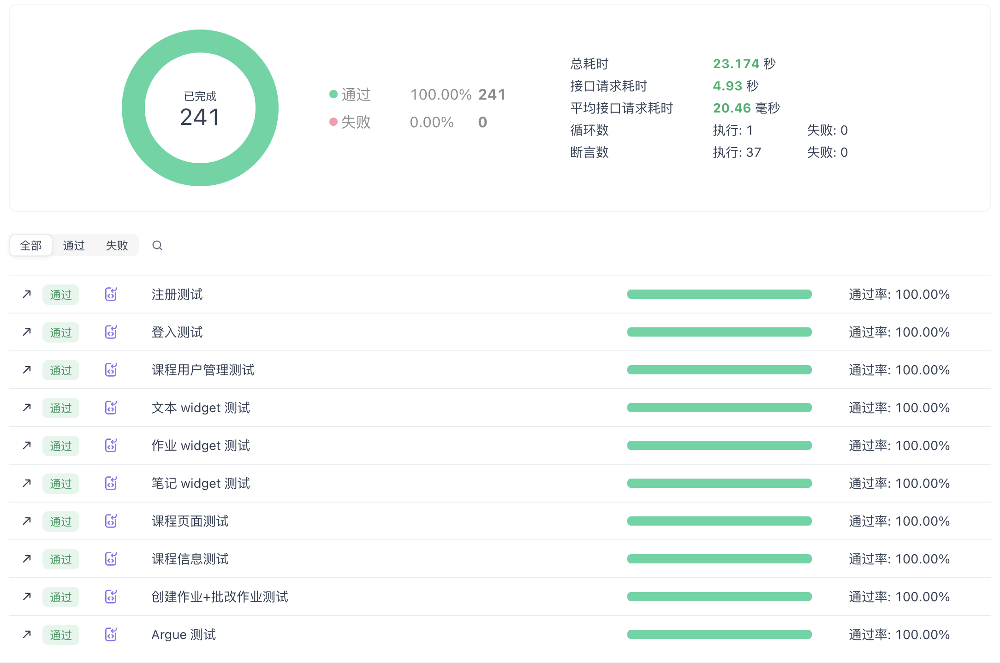

# Team 12 Final Report

## Metrics

**Backend**

| Metric                       | Value |
| ---------------------------- | ----- |
| Lines of Code                | 3623  |
| Number of Source Files       | 54    |
| Cyclomatic Complexity (Avg.) | 1.8   |
| Number of Dependencies       | 15    |

**Frontend**

| Metric                       | Value |
| ---------------------------- | ----- |
| Lines of Code                |       |
| Number of Source Files       |       |
| Cyclomatic Complexity (Avg.) |       |
| Number of Dependencies       |       |

## Documentation

*User Guide:* [Ave MujiCLASS User Guide](https://github.com/sustech-cs304/team-project-25spring-12/wiki)

*Development-guide (API Doc):* [Ave MujiCLASS API Doc](https://apifox.com/apidoc/shared/83671614-bb25-433f-b697-aad585f059cf)

## Tests

**API Tests**

We adapted [Apifox](https://apifox.com/) to test our backend. Apifox stands out as a highly efficient tool for API testing due to its all-in-one, collaborative approach. Apifox can reate complex test scenarios visually with its intuitive interface. Supports environments, variables, assertions, and data-driven testing without heavy scripting.

We designed 10 senarios for testing. You can refer to the following test reports for details (authentication is needed, we also provide overall screenshots):

- [Registation test](https://app.apifox.com/link/project/5946426/api-test/test-report/11952570?branchId=5634400)
- [Authentication test](https://app.apifox.com/link/project/5946426/api-test/test-report/11952604?branchId=5634400)
- [Course management test](https://app.apifox.com/link/project/5946426/api-test/test-report/11955087?branchId=5634400)
- [Class layout test](https://app.apifox.com/link/project/5946426/api-test/test-report/11955088?branchId=5634400)
- [Text widget test](https://app.apifox.com/link/project/5946426/api-test/test-report/11956008?branchId=5634400)
- [Share Note PDF test](https://app.apifox.com/link/project/5946426/api-test/test-report/11956014?branchId=5634400)
- [Assignment test](https://app.apifox.com/link/project/5946426/api-test/test-report/11956014?branchId=5634400)
- [Feedback test](https://app.apifox.com/link/project/5946426/api-test/test-report/11956012?branchId=5634400)
- [Argue test](https://app.apifox.com/link/project/5946426/api-test/test-report/11956048?branchId=5634400)



Our tests covered all of our APIs.

## Build

### Frontend

### Backend

Our FastAPI project uses the following build tools and technologies:
- **Python venv**: For project environment isolation
- **Flake8**: For static code analysis
- **APIfox**: For API testing
- **Swagger UI**: Built-in API documentation generation with FastAPI
- **Docker**: For containerization

#### Build Tasks

Our automated build process executes the following tasks:

1. **Environment Setup**:
   - Create Python virtual environment
   - Install project dependencies (`pip install -r requirements.txt`)

2. **Code Quality Checks**:
   - Run Flake8 for code style validation

3. **API Testing**:
   - Execute API tests using APIfox
   - Generate test reports

4. **Documentation Generation**:
   - Auto-generate Swagger UI documentation (built-in FastAPI feature)

5. **Containerization**:
   - Build Docker image from Dockerfile
   - Package application into container

#### Build Artifacts

Successful build produces:
1. Configured virtual environment
2. Flake8 analysis report
3. APIfox test reports
4. Swagger UI interactive API documentation (accessible via `/docs`)
5. Docker container image

#### Build Docker Image Script (`run.sh`)
```bash
sudo docker build -t mjc .
sudo docker stop mjc
sudo docker remove mjc
sudo docker run mjc --env-file env.list \
                    --add-host=host.docker.internal:host-gateway \ 
                    --name mjc 
                    -p 8080:80  
```

### Dockerfile
```dockerfile
FROM python:3.12
WORKDIR /code

COPY ./requirements.txt /code/requirements.txt

RUN pip install --no-cache-dir --upgrade -r /code/requirements.txt

COPY ./mjc /code/mjc
COPY main.py /code

CMD ["uvicorn", "main:app", "--host", "0.0.0.0", "--port", "80"]
```

This build process ensures code quality, API functionality verification, and containerized deployment while maintaining simplicity and practicality.

## Deploy

### Frontend

### Backend

We can simply use our Dockerfile for containerizing.

```bash
git clone https://github.com/sustech-cs304/team-project-25spring-12.git
cd backend

sudo docker build -t mjc .
sudo docker run mjc --env-file env.list \
                    --add-host=host.docker.internal:host-gateway \ 
                    --name mjc 
                    -p 8080:80  
```